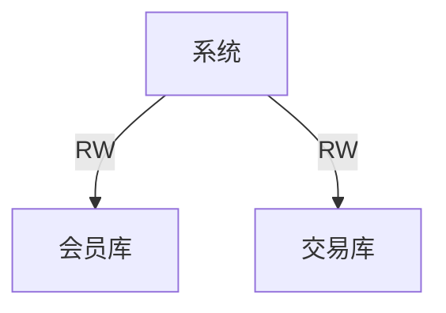
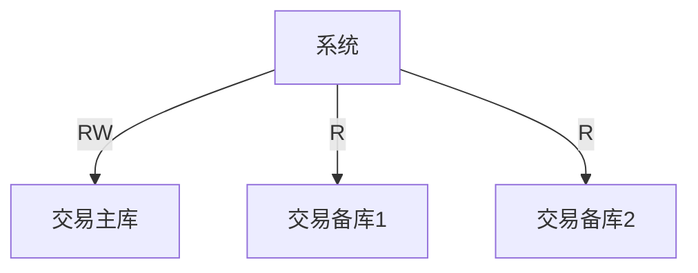
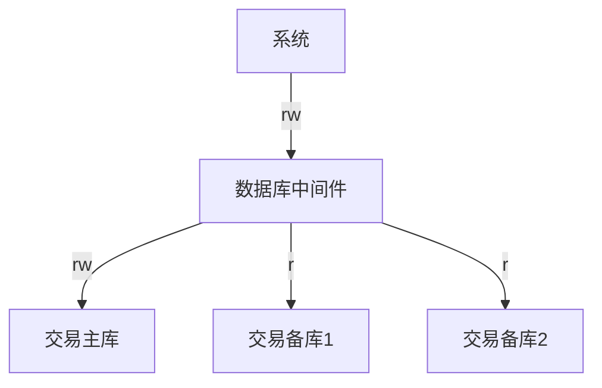
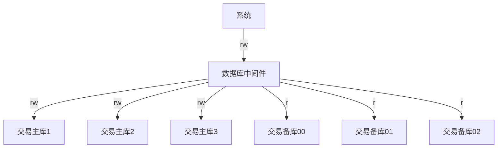
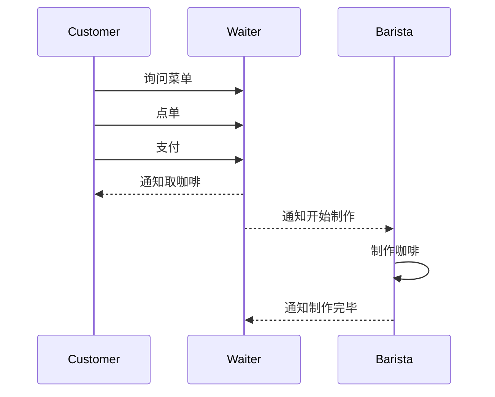

# Srping全家桶

## 配置单数据源

### 基于SpringBoot方式

```java
@SpringBootApplication
@Slf4j
public class SpringDatasourceApplication implements CommandLineRunner {

	@Autowired
	private DataSource dataSource;

	@Autowired
	private JdbcTemplate jdbcTemplate;

	public static void main(String[] args) {
		SpringApplication.run(SpringDatasourceApplication.class, args);
	}

	@Override
	public void run(String... args) throws Exception {
		showConnection();
		showData();
	}

	private void showConnection() throws SQLException {
		log.info("数据源："+dataSource.toString());
		Connection conn = dataSource.getConnection();
		log.info("连接："+conn.toString());
		conn.close();
	}

	private void showData() {
		jdbcTemplate.queryForList("SELECT * FROM user")
				.forEach(row -> log.info("记录："+row.toString()));
	}
}
```

application.properties文件的配置项

```properties
management.endpoints.web.exposure.include=*
spring.output.ansi.enabled=ALWAYS

spring.datasource.url=jdbc:h2:mem:demodb
spring.datasource.username=sa
spring.datasource.password=
```

运行结果


其实我们并没有去对DataSource进行bean配置，只是指定了数据库的类型，加载了建表语句和初始化数据语句，可以看到连接池是Hikari，这也是springboot默认的连接池。
由于是使用的内置数据库，我们可以在代码中

这也是因为springboot给我们自动装配了我们所需要的信息，由于我们引入了actuator，我们可以通过http://localhost:8080/actuator/beans 看到springboot帮我们装载了很多的bean，有些可能是我们根本用不到的。下面我们讲一下原生Spring方式怎么实现配置数据源。

### 基于Spring原生方式

pom文件配置内容

```xml
<dependency>
            <groupId>org.springframework</groupId>
            <artifactId>spring-context</artifactId>
            <version>${spring.version}</version>
        </dependency>
        <dependency>
            <groupId>org.springframework</groupId>
            <artifactId>spring-jdbc</artifactId>
            <version>${spring.version}</version>
        </dependency>
        <dependency>
            <groupId>org.apache.commons</groupId>
            <artifactId>commons-dbcp2</artifactId>
            <version>2.8.0</version>
        </dependency>
        <dependency>
            <groupId>com.h2database</groupId>
            <artifactId>h2</artifactId>
            <version>1.4.200</version>
            <scope>runtime</scope>
        </dependency>
```

		**创建applicationContext.xml文件，内容如下：**  
<?xml version="1.0" encoding="UTF-8"?>
<beans xmlns="http://www.springframework.org/schema/beans"
       xmlns:xsi="http://www.w3.org/2001/XMLSchema-instance"
       xmlns:context="http://www.springframework.org/schema/context"
       xsi:schemaLocation="http://www.springframework.org/schema/beans
        http://www.springframework.org/schema/beans/spring-beans.xsd
        http://www.springframework.org/schema/context
        http://www.springframework.org/schema/context/spring-context.xsd">

    <context:component-scan base-package="com.xxx.xxxx" />
    <!--
    <bean id="dataSource" class="org.apache.commons.dbcp.BasicDataSource"
          destroy-method="close">
        <property name="driverClassName" value="org.h2.Driver"/>
        <property name="url" value="jdbc:h2:mem:testdb"/>
        <property name="username" value="SA"/>
        <property name="password" value=""/>
    </bean>
    -->
</beans>
```


自定义DataSource，这里使用注解来实现（使用dbcp连接池）

​```java
@Configuration
@EnableTransactionManagement
public class DataSourceDemo {
    @Autowired
    private DataSource dataSource;

    public static void main(String[] args) throws SQLException {
        ApplicationContext applicationContext =
                new ClassPathXmlApplicationContext("applicationContext*.xml");
        showBeans(applicationContext);
        dataSourceDemo(applicationContext);
    }

    @Bean(destroyMethod = "close")
    public DataSource dataSource() throws Exception {
        Properties properties = new Properties();
        properties.setProperty("driverClassName", "org.h2.Driver");
        properties.setProperty("url", "jdbc:h2:mem:testdb");
        properties.setProperty("username", "sa");
        return BasicDataSourceFactory.createDataSource(properties);
    }

    @Bean
    public PlatformTransactionManager transactionManager() throws Exception {
        return new DataSourceTransactionManager(dataSource());
    }

    private static void showBeans(ApplicationContext applicationContext) {
        System.out.println(Arrays.toString(applicationContext.getBeanDefinitionNames()));
    }

    private static void dataSourceDemo(ApplicationContext applicationContext) throws SQLException {
        DataSourceDemo demo = applicationContext.getBean("dataSourceDemo", DataSourceDemo.class);
        demo.showDataSource();
    }

    public void showDataSource() throws SQLException {
        System.out.println(dataSource.toString());
        Connection conn = dataSource.getConnection();
        System.out.println(conn.toString());
        conn.close();
    }
}
```

运行main方法


**通过上面的两个例子，我们可以看出SpringBoot帮我们实现了如下功能：**

- 通过DataSourceAutoConfiguration 配置 DataSource
- 通过DataSourceTransactionManagerAutoConfiguration 配置 DataSourceTransactionManager
- 通过JdbcTemplateAutoConfiguration 配置 JdbcTemplate
  当然上面是按需来配置的，如果我们在代码中已经配置了一个DataSource，SpringBoot不会再帮我们配置一个DataSource

## 配置多数据源

因为SpringBoot会实现自动配置，但是SpringBoot并不知道我们的业务场景分别要使用哪一个数据源，因此我们需要把相关的自动配置关闭。

**首先，生成项目骨架，引入相应的依赖**

```xml
 <dependency>
 		<groupId>org.springframework.boot</groupId>
 		<artifactId>spring-boot-starter-jdbc</artifactId>
 	</dependency>
 	<dependency>
 		<groupId>org.springframework.boot</groupId>
 		<artifactId>spring-boot-starter-actuator</artifactId>
 	</dependency>
 	<dependency>
 		<groupId>org.springframework.boot</groupId>
 		<artifactId>spring-boot-starter-web</artifactId>
 	</dependency>

 	<dependency>
 		<groupId>com.h2database</groupId>
 		<artifactId>h2</artifactId>
 		<scope>runtime</scope>
 	</dependency>
 	<dependency>
 		<groupId>org.projectlombok</groupId>
 		<artifactId>lombok</artifactId>
 		<optional>true</optional>
 	</dependency>
 	<dependency>
 		<groupId>org.springframework.boot</groupId>
 		<artifactId>spring-boot-starter-test</artifactId>
 		<scope>test</scope>
 	</dependency>
```

**然后，在Application排除自动装配类** 

```java
@SpringBootApplication(exclude = { DataSourceAutoConfiguration.class,DataSourceTransactionManagerAutoConfiguration.class,JdbcTemplateAutoConfiguration.class})
@Slf4j
public class MultiDataSourceDemoApplication {
}
```

上面代码中，我们排除了DataSourceAutoConfiguration、DataSourceTransactionManagerAutoConfiguration、JdbcTemplateAutoConfiguration三个类，然后就可以自己定义DataSource了。

**配置数据源**

```java
	//第一个数据源
	@Bean
	@ConfigurationProperties("first.datasource")
	public DataSource firstDataSource() {
		return DataSourceBuilder.create().build();
	}

	@Bean
	public JdbcTemplate firstJdbcTemplate() {
		return new JdbcTemplate(firstDataSource());
	}


	@Bean
	@Resource
	public PlatformTransactionManager firstTxManager(DataSource firstDataSource) {
		return new DataSourceTransactionManager(firstDataSource);
	}

	//第二个数据源
	@Bean
	@ConfigurationProperties("second.datasource")
	public DataSource secondDataSource() {
		return DataSourceBuilder.create().build();
	}

	@Bean
	public JdbcTemplate secondJdbcTemplate() {
		return new JdbcTemplate(secondDataSource());
	}

	@Bean
	@Resource
	public PlatformTransactionManager secondTxManager(DataSource secondDataSource) {
		return new DataSourceTransactionManager(secondDataSource);
	}
```

**application.properties的配置项信息**

```peoperties
management.endpoints.web.exposure.include=*
spring.output.ansi.enabled=ALWAYS

first.datasource.jdbc-url=jdbc:mysql://localhost:3306/first
first.datasource.username=root
first.datasource.password=xxx
second.datasource.jdbc-url=jdbc:mysql://localhost:3306/second
second.datasource.username=root
second.datasource.password=xxx
```

**运行测试代码：**


## HikariCP连接池

 为什么HikariCP那么快呢？根据官网概要总结了以下几点

- 字节码精简 ：字节码级别优化（很多⽅法通过 JavaAssist ⽣成），直到编译后的字节码最少，这样，CPU缓存可以加载更多的程序代码；
- 优化代理和拦截器：减少代码，例如HikariCP的Statement proxy只有100行代码，只有BoneCP的十分之一；
- 自定义数组类型：（FastStatementList）代替ArrayList：避免每次get()调用都要进行range check，避免调用remove()时的从头到尾的扫描；
- 自定义集合类型（ConcurrentBag：提高并发读写的效率；
- 代理类的优化（⽐如，⽤ invokestatic 代替了 invokevirtual）
- 其他针对BoneCP缺陷的优化，比如对于耗时超过一个CPU时间片的方法调用的研究（但没说具体怎么优化）。

**既然HikariCP那么快，接下来就看一下在Spring中怎么使用HikariCP？**

>在Spring Boot 2.x中
>• 默认使⽤ HikariCP
>• 配置 spring.datasource.hikari.* 配置

>在Spring Boot 1.x中
>• 默认使⽤ Tomcat 连接池，需要移除 tomcat-jdbc 依赖
>• 在application.properties文件中加上spring.datasource.type=com.zaxxer.hikari.HikariDataSource

**我们来看一下SpringBoot2.0怎么使用配置HikariDataSource的**

**下面是org.springframework.boot.autoconfigure.jdbc.DataSourceConfiguration中的相关代码**

```java
/**
* 下面的三个注解意思是当classpath中有HikariDataSource.class，并且Spring上下文中没有配置DataSource的bean
* 并且spring.datasource.type的值是com.zaxxer.hikari.HikariDataSource的时候，SpringBoot自动帮我们选择默认的连接池是HikariDataSource
*/
@ConditionalOnClass({HikariDataSource.class})
@ConditionalOnMissingBean({DataSource.class})
@ConditionalOnProperty(name = {"spring.datasource.type"},havingValue = "com.zaxxer.hikari.HikariDataSource",matchIfMissing = true)
static class Hikari {
        Hikari() {
}

@Bean
@ConfigurationProperties(prefix = "spring.datasource.hikari")
HikariDataSource dataSource(DataSourceProperties properties) {
            HikariDataSource dataSource = (HikariDataSource)DataSourceConfiguration.createDataSource(properties, HikariDataSource.class);
            if (StringUtils.hasText(properties.getName())) {
                dataSource.setPoolName(properties.getName());
            }
            return dataSource;
        }
}
```

最后看看，HikariCp配置的参数有哪些？

```properties
# 不同数据源这四个配置都会用到
spring.datasource.url=jdbc:mysql://localhost:3306/test
spring.datasource.username=root
spring.datasource.password=123456
spring.datasource.driver-class-name=com.mysql.jdbc.Driver

#以下的配置项是hikari特有的配置
# 等待连接池分配连接的最大时长（毫秒），超过这个时长还没可用的连接则发生SQLException， 默认:30秒
spring.datasource.hikari.connection-timeout=30000
# 最小连接数
spring.datasource.hikari.minimum-idle=5
# 最大连接数
spring.datasource.hikari.maximum-pool-size=15
# 自动提交
spring.datasource.hikari.auto-commit=true
# 一个连接idle状态的最大时长（毫秒），超时则被释放（retired），默认:10分钟
spring.datasource.hikari.idle-timeout=600000
# 连接池名字
spring.datasource.hikari.pool-name=DatebookHikariCP
# 一个连接的生命时长（毫秒），超时而且没被使用则被释放（retired），默认:30分钟 1800000ms，建议设置比数据库超时时长少60秒
spring.datasource.hikari.max-lifetime=28740000
spring.datasource.hikari.connection-test-query=SELECT 1

#以下是针对MYSQL驱动的配置参数
# 在每个连接中缓存的语句的数量。默认值为保守值25。建议将其设置为250-500之间
spring.datasource.hikari.prepStmtCacheSize = 300
# 缓存的已准备SQL语句的最大长度，默认值是256，但是往往这个长度不够用
spring.datasource.hikari.prepStmtCacheSqlLimit = 2048
# 缓存开关，如果这里设置为false，上面两个参数都不生效
spring.datasource.hikari.cachePrepStmts = true
#较新版本的 MySQL 支持服务器端准备好的语句，这可以提供实质性的性能提升
spring.datasource.hikari.useServerPrepStmts = true
```

## Durid连接池

**添加依赖**

```xml
    <dependencies>
        <!-- spring jdbc 操作模版 -->
        <dependency>
            <groupId>org.springframework.boot</groupId>
            <artifactId>spring-boot-starter-jdbc</artifactId>
        </dependency>

        <!-- springboot web开发 -->
        <dependency>
            <groupId>org.springframework.boot</groupId>
            <artifactId>spring-boot-starter-web</artifactId>
        </dependency>

        <!-- mysql 数据库连接 -->
        <dependency>
            <groupId>mysql</groupId>
            <artifactId>mysql-connector-java</artifactId>
            <scope>runtime</scope>
        </dependency>

        <!-- 引入druid数据源 -->
        <dependency>
            <groupId>com.alibaba</groupId>
            <artifactId>druid</artifactId>
            <version>1.1.12</version>
        </dependency>
        
        <dependency>
            <groupId>org.springframework.boot</groupId>
            <artifactId>spring-boot-starter-test</artifactId>
            <scope>test</scope>
        </dependency>

    </dependencies>

```

**配置数据源信息**

常规的 JDBC 配置不需要配置这么多内容，这里因为使用了 Druid 连接池，所以配置了 Druid 部分

```yaml
spring:
  datasource:
    username: root
    password: 123
    url: jdbc:mysql://127.0.0.1:3306/springboot?characterEncoding=utf-8&serverTimezone=GMT%2B8
    driver-class-name: com.mysql.jdbc.Driver
    type: com.alibaba.druid.pool.DruidDataSource

    initialSize: 5
    minIdle: 5
    maxActive: 20
    maxWait: 60000
    timeBetweenEvictionRunsMillis: 60000
    minEvictableIdleTimeMillis: 300000
    validationQuery: SELECT 1 FROM DUAL
    testWhileIdle: true
    testOnBorrow: false
    testOnReturn: false
    poolPreparedStatements: true
    #   配置监控统计拦截的filters，去掉后监控界面sql无法统计，'wall'用于防火墙
    filters: stat
    maxPoolPreparedStatementPerConnectionSize: 20
    useGlobalDataSourceStat: true
    connectionProperties: druid.stat.mergeSql=true;druid.stat.slowSqlMillis=500

```

配置完毕之后，配置信息还不能绑定到 Druid 数据源中，还需要新建一个配置类绑定数据源和配置信息。

```java
/**
 * <p>
 * Druid 数据源配置
 *
 * @Author niujinpeng
 * @Date 2019/1/14 22:20
 */
@Configuration
public class DruidConfig {
    /**
     * 配置绑定
     * @return
     */
    @Bean
    @ConfigurationProperties(prefix = "spring.datasource")
    public DruidDataSource druid() {
        return new DruidDataSource();
    }
}
```

编写测试方法测试 druid 连接池是否生效。

```java

@RunWith(SpringRunner.class)
@SpringBootTest
public class SpringbootDataJdbcApplicationTests {
    @Autowired
    DataSource dataSource;
    /**
     * 测试JDBC数据源
     * @throws SQLException
     */
    @Test
    public void contextLoads() throws SQLException {
        System.out.println(dataSource.getClass());
        Connection connection = dataSource.getConnection();
        System.out.println(connection);
        connection.close();
    }
}
```

**使用Durid监控**

如果使用 Druid 连接池却不使用监控功能，那么就有点暴殄天物了。下面开始配置 Druid 的 SQL 监控功能。在上面写的 DruidConfig 配置类中增加配置 Druid 的 Servlet 和 Filter.

```java
 	/**
     * Druid的servlet
     * @return
     */
    @Bean
    public ServletRegistrationBean statViewServlet() {
        ServletRegistrationBean bean = new ServletRegistrationBean(new StatViewServlet());
        Map<String, String> initParams = new HashMap<>();
        initParams.put("loginUsername", "admin");
        initParams.put("loginPassword", "123");
        initParams.put("allow","127.0.0.1");
        bean.setInitParameters(initParams);
        bean.setUrlMappings(Arrays.asList("/druid/*"));
        return bean;
    }
    @Bean
    public FilterRegistrationBean webStatFilter() {
        FilterRegistrationBean<WebStatFilter> bean = new FilterRegistrationBean<>(new WebStatFilter());
        HashMap<String, String> initParams = new HashMap<>();
        initParams.put("exclusions", "/css,/druid/*");
        bean.setInitParameters(initParams);
        bean.setUrlPatterns(Arrays.asList("/*"));
        return bean;
    }
```

上面配置了 Druid 监控访问路径为 `/druid`、登录用户是 `admin`、登录密码是 `123`、允许访问的 IP 是 `127.0.0.1` 本机、不需要监控的请求是 `/css` 和 `/druid` 开头的请求。

重新启动项目，访问测试 `/query`，然后访问 `/durid` 登录页。

[开启Druid监控统计功能(SQL监控、慢SQL记录、Spring监控、去广告) | 唐僧肉BLOG (gitee.io)](https://tangmonk-meat.gitee.io/blog/2021/03/19/开启Druid监控统计功能(SQL监控、慢SQL记录、Spring监控、去广告)/)

## Spring事务抽象

Spring在TransactionDefinition接口中规定了7种类型的事务传播行为。事务传播行为是Spring框架独有的事务增强特性，他不属于的事务实际提供方数据库行为。这是Spring为我们提供的强大的工具箱，使用事务传播行可以为我们的开发工作提供许多便利。但是人们对他的误解也颇多，你一定也听过“service方法事务最好不要嵌套”的传言。要想正确的使用工具首先需要了解工具。本文对七种事务传播行为做详细介绍，内容主要代码示例的方式呈现。

**什么是事务传播行为**

事务传播行为用来描述由某一个事务传播行为修饰的方法被嵌套进另一个方法的时事务如何传播。

用伪代码说明：

```java
 public void methodA(){
    methodB();
    //doSomething
 }
 
 @Transaction(Propagation=XXX)
 public void methodB(){
    //doSomething
 }
```

代码中`methodA()`方法嵌套调用了`methodB()`方法，`methodB()`的事务传播行为由`@Transaction(Propagation=XXX)`设置决定。这里需要注意的是`methodA()`并没有开启事务，某一个事务传播行为修饰的方法并不是必须要在开启事务的外围方法中调用

### Spring中七种事务传播行为

| 事务传播行为类型          | 说明                                                         |
| ------------------------- | ------------------------------------------------------------ |
| PROPAGATION_REQUIRED      | 如果当前没有事务，就新建一个事务，如果已经存在一个事务中，加入到这个事务中。这是最常见的选择。 |
| PROPAGATION_SUPPORTS      | 支持当前事务，如果当前没有事务，就以非事务方式执行。         |
| PROPAGATION_MANDATORY     | 使用当前的事务，如果当前没有事务，就抛出异常。               |
| PROPAGATION_REQUIRES_NEW  | 新建事务，如果当前存在事务，把当前事务挂起。                 |
| PROPAGATION_NOT_SUPPORTED | 以非事务方式执行操作，如果当前存在事务，就把当前事务挂起。   |
| PROPAGATION_NEVER         | 以非事务方式执行，如果当前存在事务，则抛出异常。             |
| PROPAGATION_NESTED        | 如果当前存在事务，则在嵌套事务内执行。如果当前没有事务，则执行与PROPAGATION_REQUIRED类似的操作。 |

### 事务的隔离级别

| **solation Level** | **脏读可能性（Dirty Read）** | **不可重复读可能性（Non Repeatable Read）** | **幻读可能性（Phantom Read）** |
| ------------------ | ---------------------------- | ------------------------------------------- | ------------------------------ |
| read_Uncommitted   | yes                          | yes                                         | yes                            |
| read _Committed    | -                            | yes                                         | yes                            |
| read _Repeatable   | -                            | -                                           | yes                            |
| Serializable       | -                            | -                                           | -                              |

### 事务的本质

* ### Spring的声明式事务本质上是通过AOP来增强了类的功能

* Spring的AOP本质上就是为类做了一个代理

  * 看似在调用自己写的类，实际上用的是增强后的代理类

* 问题的解法

* 

## 一些Spring常用注解

[精进Spring—Spring常用注解【经典总结】_阿飞云的博客-CSDN博客_spring注解](https://blog.csdn.net/u010648555/article/details/76299467)

### Java Config相关注解

* @Configuration
* @ImporResource
* @ComponentScan
* @Bean
* @ConfigurationProperties

### 定义相关注解

* @Component/@Repository/@Service
* @Controller/@RestController
* @RequestMapping

### 注入相关注解

* @AutoWired/@Qualifier/@Resource
* @Value

## Actuator

### 一些Endpoint

| URL               | 作用               |
| ----------------- | ------------------ |
| /actuator/health  | 健康检查           |
| /actuator/beans   | 查看容器中所有bean |
| /actuator/mapping | 查看web的URL映射   |
| /actuator/env     | 查看环境信息       |

### 解禁Endpoint

默认

* /actuator/health和/actuatot/info 可web访问

解禁所有endpoint

* management.endpoint.web.exposure.include=*

## 多数据源、分库分表、读写分离的关系

### 几种常见情况

* 系统需要访问几个完全不同的数据库
* 系统需要访问同一个库的主库与备库
* 系统需要访问一组做了分库分表的数据库





### 使用数据库中间件的情况





## SpringDataJpa

### 常用JPA注解

**实体**

* @Entity 标识这个实体类是一个JPA实体、@MappedSuperclass
* @Table(name="自定义表名")

**主键**

* @Id

* @GeneratedValue（strategy,generator）
* @SequenceGenerator(name,sequenceName)

**映射**

* @Column（name,nullable,length,insetable,updatable）
* @JoinTable(name)、@JoinColumn(name)

**关系**

*@OneToOne、@OneToMany、@ManyToOne、@ManyToMany

@OrderBy

## Lombok

- @Getter 和 @Setter
- @ToString
-  @AllArgsConstructor/@NoArgsConstructor/@RequiredArgsConstructor
-  @Data  @Data 是 @Getter、 @Setter、 @ToString、 @EqualsAndHashCode 和 @RequiredArgsConstructor 的快捷方式。
- @Buidler  @Singular
- @SLF4J

## 线上咖啡馆实战

### 项目目标

通过一个完整的例子演示Spring全家桶各主要成员的用法




## Mybatis的注解使用

### mybatis的插件使用

[Spring Boot 使用 Mybatis（自动生成插件） 访问数据库 | 未读代码 (wdbyte.com)](https://www.wdbyte.com/2019/03/springboot/springboot-11-data-mybatis/#_1-springboot-mybatis-介绍)

mybatis官网

[MyBatis (github.com)](https://github.com/mybatis)

## 对MongoDB的支持

### MongoDB是一款开源的文档型数据库

### Docker启动MongoDB

#### DockerHub指导

[Mongo - Official Image | Docker Hub](https://hub.docker.com/_/mongo)

#### 获取镜像

* docker pull mongo

#### Docker启动允许MongoDB镜像

* docker run --name mongo -p 27017:27017 -v ~/docker-data/mongo:/data/db -e MONGO_INITDB_ROOT_USERNAME=admin -e MONGO_INITDB_ROOT_PASSWORD=admin -d mongo
* 具名挂载即可：docker run --name mongo -p 27017:27017 -v mongo:/data/db -e MONGO_INITDB_ROOT_USERNAME=admin -e MONGO_INITDB_ROOT_PASSWORD=admin -d mongo

查看所有挂载卷名：docker volume ps

查看指定卷详细情况：docker volume inspect 卷名

[MongoDB 教程 | 菜鸟教程 (runoob.com)](https://www.runoob.com/mongodb/mongodb-tutorial.html)

#### MongoDB的使用

* 进入镜像：docker exec -it b284bcfccce8 bash
* 登录用户：mongo -u admin -p admin
* 帮助 help

##### 初始化MongoDB的库及权限

###### 创建库

​	use springbucks;

###### 创建用户

db.createUser({user:"springbucks",pwd:"springbucks",roles:[{role:"readWrite",db:"springbucks"}]})

### Spring对MongoDB的支持

* Spring Data MongoDB
* MongoTemplate
* Repository支持

### Spring Data MongoDB的基本用法

**注解**

* @Document
* @Id

**MongoTemplate**

* sava/remove
* Criteria/ Query/ Update

## Redis

### Spring对Redis的支持

* Spring Data Redis
  * 支持的客户端 Jedis/Lettuce
  * RedisTemplate
  * Repository支持

### Jedis客户端的简单使用

* Jedis不是线程安全的
* 通过JedisPool获得Jedis实例
* 直接使用Jedis中的方法

### 通过Docker启动redis

docker run --name redis -d -p 6379:6379 redis

### Redis的哨兵模式

Redis Sentinel是Redis的一种高可用方案

* 监控、通州、自动故障转移、服务发现

JedisSentinelPool

### Spring的缓存抽象

